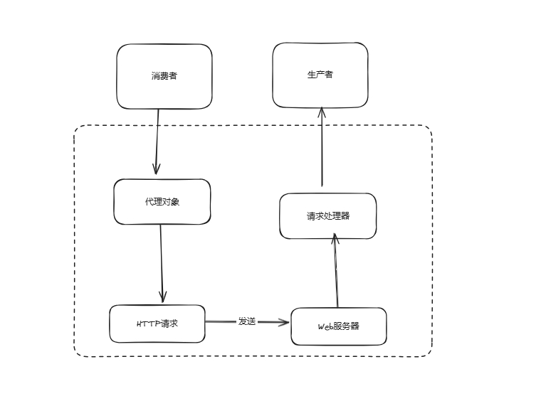

# 手写RPC框架

技术栈：

* Etcd 作为默认注册中心
* SPI机制提供自定义序列化器，容错机制，重试机制，负载均衡等等
* Vert.X提供Web服务器
* javafaker提供粗粒度mock服务
* Spring的预加载ImportBeanDefinitionRegistrar类

本框架借鉴了Dubbo的实现


## 基本理解

个人理解，RPC，远程过程调用，本身就是对远程调用做了一次封装，其简单结构如下



## 项目架构图

项目共分为8个模块：

* example-common：作为示例消费者和示例生产者的公共模块，比如实体类对象，业务接口
* example-provider：示例服务提供者
* example-consumer：示例服务消费者
* example-springboot-provider：基于spring注解的示例提供者
* example-springboot-consumer：基于spring注解的示例消费者
* shaoxia-rpc-boot-starter：对rpc-core增加了注解功能
* shaoxia-rpc-core：RPC框架核心
* shaoxia-rpc-easy：rpc早期雏形


## 项目关键类

个人理解的RPC框架的核心和功能如下：

1. 服务代理
2. 调用过程
3. 注册中心
4. 负载均衡，重试，容错机制
5. 注解驱动


### 1、服务代理

服务代理就是为需要远程调用的接口生成一个动态代理类由这个类来进行远程调用

其主要相关类如下

代理工厂类

```java
@Slf4j
public class ServiceProxyFactory {
    public static <T> T getProxy(Class<T> serviceClass){
       if (RpcApplication.getRpcConfig().isMock()){
          log.info("choose mock proxy");
          return getMockProxy(serviceClass);
       }
       return (T) Proxy.newProxyInstance(
             serviceClass.getClassLoader(),
             new Class[]{serviceClass},
             new ServiceProxy());
    }

    private static <T> T getMockProxy(Class<T> serviceClass) {
       return (T) Proxy.newProxyInstance(
             serviceClass.getClassLoader(),
             new Class[]{serviceClass},
             new MockServiceProxy());
    }
}
```

```java
UserService userService = ServiceProxyFactory.getProxy(UserService.class);
```

代理类

```java
@Slf4j
public class ServiceProxy implements InvocationHandler {

    /**
     * 调用代理
     * @param proxy the proxy instance that the method was invoked on
     *
     *
     * @return
     * @throws Throwable
     */
    @Override
    public Object invoke(Object proxy, Method method, Object[] args) throws Throwable {
       log.info("invoke method is {}",method.getName());
       log.info("invoke object is {}",method.getDeclaringClass().getName());


       RpcConfig rpcConfig = RpcApplication.getRpcConfig();

       // 构造请求
       String serviceName = method.getDeclaringClass().getName();
       RpcRequest rpcRequest = RpcRequest.builder()
             .serviceVersion(RpcConstant.DEFAULT_SERVICE_VERSION)
             .serviceName(serviceName)
             .methodName(method.getName())
             .parameterTypes(method.getParameterTypes())
             .args(args)
             .build();

       System.out.println("构造的请求为"+rpcRequest.toString());


       // 发送请求
       RegistryConfig registryConfig = rpcConfig.getRegistryConfig();
       // 获取注册中心 默认ETCD
       Registry registry = RegistryFactory.getInstance(registryConfig.getRegistry());

       ServiceMetaInfo serviceMetaInfo = new ServiceMetaInfo();
       serviceMetaInfo.setServiceName(serviceName);
       serviceMetaInfo.setServiceVersion(RpcConstant.DEFAULT_SERVICE_VERSION);
       // 获取已经注册的服务信息
       List<ServiceMetaInfo> serviceMetaInfos = registry.serviceDiscovery(serviceMetaInfo.getServiceKey());
       System.out.println("服务列表为"+serviceMetaInfos);
       if(CollUtil.isEmpty(serviceMetaInfos)){
          throw new RuntimeException("暂无服务地址");
       }
       System.out.println("开始负载均衡");
       LoadBalancer loadBalancer = LoadBalancerFactory.getInstance(rpcConfig.getLoadBalancer());
       // 将调用的方法名作为负载均衡参数
       String methodName = rpcRequest.getMethodName();
       HashMap<String, Object> requestParams = new HashMap<>();
       requestParams.put("methodName",methodName);
       ServiceMetaInfo selected = loadBalancer.select(requestParams, serviceMetaInfos);
       System.out.println("选择了"+selected);
       // 发送TCP请求
       try {
          RetryStrategy retryStrategy = RetryStrategyFactory.getInstance(rpcConfig.getRetryStrategy());
          RpcResponse rpcResponse = retryStrategy.doRetry(()->
              VertxTcpClient.doRequest(rpcRequest, selected)
          );
          return rpcResponse.getData();
       }catch (Exception e) {
          TolerantStrategy tolerantStrategy = TolerantStrategyFactory.getInstance(RpcApplication.getRpcConfig().getTolerantStrategy());
          tolerantStrategy.doTolerant(null,e);
       }

       return null;
    }
}
```


### 2、调用过程

这里的调用过程其实就是通过服务器的调用，这里使用了Vert.X，当然，也可以使用其他Web服务器，比如tomcat，Netty

同时，由于HTTP的请求头和响应头比较重，我们需要自定义自己的协议来提高性能，同时使用Vertx提供的RecordPaser来解决半包和粘包问题

VertX Client类

编码请求并接收响应

```java
@Slf4j
public class VertxTcpClient {
    public static RpcResponse doRequest(RpcRequest rpcRequest, ServiceMetaInfo serviceMetaInfo) throws ExecutionException, InterruptedException {
       System.out.println("发送了TCP请求");
       // 发送 TCP 请求
       Vertx vertx = Vertx.vertx();
       NetClient netClient = vertx.createNetClient();
       CompletableFuture<RpcResponse> responseFuture = new CompletableFuture<>();
       netClient.connect(serviceMetaInfo.getServicePort(), serviceMetaInfo.getServiceHost(),
             result -> {
                if (!result.succeeded()) {
                   System.err.println("Failed to connect to TCP server");
                   return;
                }
                NetSocket socket = result.result();
                // 发送数据
                // 构造消息
                ProtocolMessage<RpcRequest> protocolMessage = new ProtocolMessage<>();
                ProtocolMessage.Header header = new ProtocolMessage.Header();
                header.setMagic(ProtocolConstant.PROTOCOL_MAGIC);
                header.setVersion(ProtocolConstant.PROTOCOL_VERSION);
                header.setSerializer((byte) ProtocolMessageSerializerEnum.getByValue(RpcApplication.getRpcConfig().getSerializer()).getKey());
                header.setType((byte) ProtocolMessageTypeEnum.REQUEST.getKey());
                // 生成全局请求 ID
                header.setRequestId(IdUtil.getSnowflakeNextId());
                protocolMessage.setHeader(header);
                protocolMessage.setBody(rpcRequest);

                // 编码请求
                try {
                   Buffer encodeBuffer = ProtocolMessageEncoder.encode(protocolMessage);
                   socket.write(encodeBuffer);
                } catch (IOException e) {
                   throw new RuntimeException("协议消息编码错误");
                }

                // 接收响应
                TcpBufferHandlerWrapper bufferHandlerWrapper = new TcpBufferHandlerWrapper(
                      buffer -> {
                         try {
                            ProtocolMessage<RpcResponse> rpcResponseProtocolMessage =
                                  (ProtocolMessage<RpcResponse>) ProtocolMessageDecoder.decode(buffer);
                            responseFuture.complete(rpcResponseProtocolMessage.getBody());
                         } catch (IOException e) {
                            throw new RuntimeException("协议消息解码错误");
                         }
                      }
                );
                socket.handler(bufferHandlerWrapper);
             });

       RpcResponse rpcResponse = responseFuture.get();
       // 关闭连接
       netClient.close();
       return rpcResponse;
    }

}
```

Vert Server类

自定义的消息处理器处理消息后生成的buffer，通过解码器解码后获取RPC请求，根据请求参数去调用指定服务，并编码结果，发送响应

```java
@Slf4j
public class TcpServerHandler implements Handler<NetSocket> {
    @Override
    public void handle(NetSocket socket) {
       log.info("handler socket");
       TcpBufferHandlerWrapper bufferHandlerWrapper = new TcpBufferHandlerWrapper(buffer -> {
          // 接受请求，解码
          log.info("接收请求，解码");
          ProtocolMessage<RpcRequest> protocolMessage;
          try {
             protocolMessage = (ProtocolMessage<RpcRequest>) ProtocolMessageDecoder.decode(buffer);
             log.info("protocolMessage{}", protocolMessage);
          } catch (IOException e) {
             throw new RuntimeException("协议消息解码错误");
          }
          RpcRequest rpcRequest = protocolMessage.getBody();
          ProtocolMessage.Header header = protocolMessage.getHeader();

          log.info("rpcRequest{}", rpcRequest);
          // 处理请求
          // 构造响应结果对象
          RpcResponse rpcResponse = new RpcResponse();
          try {
             // 获取要调用的服务实现类，通过反射调用
             Class<?> implClass = LocalRegistry.get(rpcRequest.getServiceName());
             Method method = implClass.getMethod(rpcRequest.getMethodName(), rpcRequest.getParameterTypes());
             Object result = method.invoke(implClass.newInstance(), rpcRequest.getArgs());
             // 封装返回结果
             rpcResponse.setData(result);
             rpcResponse.setDataType(method.getReturnType());
             rpcResponse.setMessage("ok");
          } catch (Exception e) {
             e.printStackTrace();
             rpcResponse.setMessage(e.getMessage());
             rpcResponse.setException(e);
          }

          // 发送响应，编码
          header.setType((byte) ProtocolMessageTypeEnum.RESPONSE.getKey());
          header.setStatus((byte) ProtocolMessageStatusEnum.OK.getValue());
          ProtocolMessage<RpcResponse> responseProtocolMessage = new ProtocolMessage<>(header, rpcResponse);
          log.info("responseProtocolMessage{}", responseProtocolMessage);
          try {
             Buffer encode = ProtocolMessageEncoder.encode(responseProtocolMessage);
             socket.write(encode);
          } catch (IOException e) {
             throw new RuntimeException("协议消息编码错误");
          }
       });

       socket.handler(bufferHandlerWrapper);
    }
}
```

对VertX的RecordParser进行包装来解决半包粘包问题

RecordParser是通过消息头来识别一次消息

`RecordParser parser = RecordParser.newFixed(ProtocolConstant.MESSAGE_HEADER_LENGTH);`设置消息图，之后循环俩次，第一次读取消息头，第二次根据消息头里的消息体长度来读取消息体

```java
 public class TcpBufferHandlerWrapper implements Handler<Buffer> {

    /**
     * 解析器，用于解决半包、粘包问题
     */
    private final RecordParser recordParser;

    public TcpBufferHandlerWrapper(Handler<Buffer> bufferHandler) {
       recordParser = initRecordParser(bufferHandler);
    }

    @Override
    public void handle(Buffer buffer) {
       recordParser.handle(buffer);
    }

    /**
     * 初始化解析器
     *
     * @param bufferHandler
     * @return
     */
    private RecordParser initRecordParser(Handler<Buffer> bufferHandler) {
       // 构造 parser
       RecordParser parser = RecordParser.newFixed(ProtocolConstant.MESSAGE_HEADER_LENGTH);

       parser.setOutput(new Handler<Buffer>() {
          // 初始化
          int size = -1;
          // 一次完整的读取（头 + 体）
          Buffer resultBuffer = Buffer.buffer();

          @Override
          public void handle(Buffer buffer) {
             // 1. 每次循环，首先读取消息头
             if (-1 == size) {
                // 读取消息体长度
                size = buffer.getInt(13);
                parser.fixedSizeMode(size);
                // 写入头信息到结果
                resultBuffer.appendBuffer(buffer);
             } else {
                // 2. 然后读取消息体
                // 写入体信息到结果
                resultBuffer.appendBuffer(buffer);
                // 已拼接为完整 Buffer，执行处理
                bufferHandler.handle(resultBuffer);
                // 重置一轮
                parser.fixedSizeMode(ProtocolConstant.MESSAGE_HEADER_LENGTH);
                size = -1;
                resultBuffer = Buffer.buffer();
             }
          }
       });

       return parser;
    }
}
```


### 3、注册中心

这里的注册中心主要分为俩类：本地注册器，远程注册中心。二者各司其职。

#### 本地注册器

LocalRegistry类

在provider注册服务到远程的注册中心之前，需要先注册到本地一个服务实例，其目的是使用单例模式来处理请求

```java
public class LocalRegistry {
    private static final Map<String,Class<?>> map = new ConcurrentHashMap<>();

    /**
     * 服务注册
     * @param serviceName
     * @param impClass
     */
    public static void register(String serviceName,Class<?> impClass){
       map.put(serviceName,impClass);
    }

    /**
     * 获取服务
     * @param name
     * @return
     */
    public static Class<?> get(String name){
       return map.get(name);
    }

    /**
     * 移除服务
     * @param name
     */
    public static void remove(String name){
       map.remove(name);
    }
}
```

#### Etcd注册中心

注册中心作为消费者发现服务的基本位置。这里使用Etcd作为注册中心。Etcd是采用层次化的结构方式的kV存储，底层使用Raft算法保持一致性

首先我们定义基本的注册中心接口，方便使用SPI扩展其他注册中心

```java
public interface Registry {
    /**
     * 初始化
     * @param registryConfig
     */
    void init(RegistryConfig registryConfig);

    /**
     * 服务注册
     * @param serviceMetaInfo
     */
    void register(ServiceMetaInfo serviceMetaInfo) throws Exception;

    /**
     * 服务注销
     * @param serviceMetaInfo
     */
    void unRegister(ServiceMetaInfo serviceMetaInfo);

    /**
     * 服务发现
     * @param serviceKey
     * @return
     */
    List<ServiceMetaInfo> serviceDiscovery(String serviceKey);

    /**
     * 服务销毁
     */
    void destroy();

    /**
     * 心跳机制（提供者）
     */
    void heartBeat();

    /**
     * 监听一个服务（消费者端）
     * @param watchNodeKey
     */
    void watch(String watchNodeKey);
}
```

Etcd注册中心实现

* 初始化：通过全局配置进行初始化
* 服务注册：key：/rpc/serviceName:serviceVersion/serviceHost/servicePort value: ServiceMetaInfo 并设置过期时间（租期）
* 服务发现：消费者通过key寻找到指定服务，并缓存到本地
* 心跳机制：使用定时任务在指定时间内向注册中心续签
* 监听机制：消费者监听指定key，如果触发了delete时间，就删除缓存

```java
@Slf4j
public class EtcdRegistry implements Registry{
    private Client client;

    private KV kvClient;

    private final Set<String> localRegisterNodeKeySet = new HashSet<>();

    private static final String ETCD_ROOT_PATH = "/rpc/";

    private final RegistryServiceCache registryServiceCache = new RegistryServiceCache();

    /**
     * 正在监听的节点集合
     */
    private final Set<String> watchingNodeSet = new ConcurrentHashSet<>();

    @Override
    public void init(RegistryConfig registryConfig) {
       client = Client.builder().endpoints(registryConfig.getRegistryAddress())
             .connectTimeout(Duration.ofMillis(registryConfig.getTimeout()))
             .build();
       kvClient = client.getKVClient();
       heartBeat();
    }

    @Override
    public void register(ServiceMetaInfo serviceMetaInfo) throws Exception {
       Lease leaseClient = client.getLeaseClient();

       long leaseId = leaseClient.grant(30).get().getID();

       // 设置要存储的键值对
       String registerKey = ETCD_ROOT_PATH + serviceMetaInfo.getServiceNodeKey();
       ByteSequence key = ByteSequence.from(registerKey, StandardCharsets.UTF_8);
       ByteSequence value = ByteSequence.from(JSONUtil.toJsonStr(serviceMetaInfo), StandardCharsets.UTF_8);

       // 把键值对和租约关联起来
       PutOption putOption = PutOption.builder().withLeaseId(leaseId).build();
       kvClient.put(key,value,putOption).get();
       localRegisterNodeKeySet.add(registerKey);
    }

    @Override
    public void unRegister(ServiceMetaInfo serviceMetaInfo) {
       String key = serviceMetaInfo.getServiceKey();
       kvClient.delete(ByteSequence.from(ETCD_ROOT_PATH+serviceMetaInfo.getServiceNodeKey(),StandardCharsets.UTF_8));
       localRegisterNodeKeySet.remove(key);
    }

    @Override
    public List<ServiceMetaInfo> serviceDiscovery(String serviceKey) {
       List<ServiceMetaInfo> serviceMetaInfosInCache = registryServiceCache.readCache();
       if (serviceMetaInfosInCache != null){
          return serviceMetaInfosInCache;
       }

       // 前缀搜索
       String searchPrefix = ETCD_ROOT_PATH + serviceKey + "/";

       try {
          GetOption getOption = GetOption.builder().isPrefix(true).build();
          List<KeyValue> kvs = kvClient.get(
                      ByteSequence.from(searchPrefix, StandardCharsets.UTF_8),
                      getOption
                ).get()
                .getKvs();
          List<ServiceMetaInfo> serviceMetaInfos = kvs.stream().map(keyValue -> {
             // 监听服务
             String key = keyValue.getKey().toString(StandardCharsets.UTF_8);
             watch(key);
             String value = keyValue.getValue().toString(StandardCharsets.UTF_8);
             return JSONUtil.toBean(value, ServiceMetaInfo.class);
          }).collect(Collectors.toList());
          // 写入服务缓存
          registryServiceCache.writeCache(serviceMetaInfos);
          return serviceMetaInfos;
       }catch (Exception e){
          throw new RuntimeException("获取服务列表失败",e);
       }
    }

    @Override
    public void destroy() {
       System.out.println("当前节点下线");
       // 下线所有节点
       for (String registerKey : localRegisterNodeKeySet) {
          try {
             kvClient.delete(ByteSequence.from(registerKey,StandardCharsets.UTF_8));
          }catch (Exception e){
             throw new RuntimeException(registerKey + "节点下线失败");
          }
       }
       if (kvClient != null) {
          kvClient.close();
       }
       if (client != null){
          client.close();
       }

    }

    @Override
    public void heartBeat() {
       CronUtil.schedule("*/10 * * * * *", (Task) () -> {
          for (String registryKey : localRegisterNodeKeySet) {
             try {
                List<KeyValue> kvs = kvClient.get(ByteSequence.from(registryKey, StandardCharsets.UTF_8))
                      .get()
                      .getKvs();
                if (CollUtil.isEmpty(kvs)){
                   continue;
                }
                KeyValue keyValue = kvs.get(0);
                String value = keyValue.getValue().toString(StandardCharsets.UTF_8);
                ServiceMetaInfo serviceMetaInfo = JSONUtil.toBean(value, ServiceMetaInfo.class);
                register(serviceMetaInfo);
             } catch (Exception e) {
                throw new RuntimeException("续签失败",e);
             }
          }
       });

       CronUtil.setMatchSecond(true);
       CronUtil.start();

    }

    /**
     * 监听（消费端）
     * @param watchNodeKey 监听的服务Key
     */
    @Override
    public void watch(String watchNodeKey) {
       Watch watchClient = client.getWatchClient();
       // 添加新的监听
       boolean newWatch = watchingNodeSet.add(watchNodeKey);
       if (newWatch){
          watchClient.watch(ByteSequence.from(watchNodeKey,StandardCharsets.UTF_8),watchResponse -> {
             for (WatchEvent event : watchResponse.getEvents()) {
                switch (event.getEventType()){
                   // key 删除时触发
                   case DELETE:
                      registryServiceCache.clear();
                      break;
                   case PUT:
                   default:
                      break;
                }
             }
          });
       }

    }
}
```


### 4、负载均衡，重试和容错机制

#### 负载均衡

负载均衡策略支持3种：

* 根据参数进行一致性哈希得到
* 随机
* 轮询

负载均衡接口

```java
public interface LoadBalancer {
    /**
     * 选择服务器调用
     * @param requestParams 请求参数
     * @param serviceMetaInfoList  待选择的服务列表
     * @return
     */
    ServiceMetaInfo select(Map<String,Object> requestParams, List<ServiceMetaInfo> serviceMetaInfoList);
}
```

一致性哈希

```java
public class ConsistHashLoadBalancer implements LoadBalancer{
    /**
     * 虚拟节点
     */
    private final TreeMap<Integer,ServiceMetaInfo> virtualNode = new TreeMap<>();

    /**
     * 虚拟节点数
     */
    private static final int VIRTUAL_NODE_NUM = 100;

    @Override
    public ServiceMetaInfo select(Map<String, Object> requestParams, List<ServiceMetaInfo> serviceMetaInfoList) {
       if (serviceMetaInfoList.isEmpty()){
          return null;
       }
       for (ServiceMetaInfo serviceMetaInfo : serviceMetaInfoList) {
          for (int i = 0; i < VIRTUAL_NODE_NUM; i++) {
             int hash = getHash(serviceMetaInfo.getServiceAddress() + "#" + i);
             virtualNode.put(hash,serviceMetaInfo);
          }
       }

       int hash = getHash(requestParams);
       // 找到第一个hash值大于当前哈希的对象
       Map.Entry<Integer, ServiceMetaInfo> ceilingEntry = virtualNode.ceilingEntry(hash);
       if (ceilingEntry == null){
          ceilingEntry =  virtualNode.firstEntry();
       }
       return ceilingEntry.getValue();
    }

    private int getHash(Object key) {
       return key.hashCode();
    }
}
```

随机

```java
public class RandomLoadBalancer implements LoadBalancer{
    private final Random random = new Random();

    @Override
    public ServiceMetaInfo select(Map<String, Object> requestParams, List<ServiceMetaInfo> serviceMetaInfoList) {
       if (serviceMetaInfoList.isEmpty()){
          return null;
       }
       int size = serviceMetaInfoList.size();
       if (size == 1) {
          return serviceMetaInfoList.get(0);
       }
       return serviceMetaInfoList.get(random.nextInt(size));
    }
}
```

轮询

```java
public class RoundRobinLoadBalancer implements LoadBalancer{
    /**
     * 当前计数的下标
     */
    private final AtomicInteger currentIndex = new AtomicInteger(0);


    @Override
    public ServiceMetaInfo select(Map<String, Object> requestParams, List<ServiceMetaInfo> serviceMetaInfoList) {
       if (serviceMetaInfoList.isEmpty()){
          return null;
       }
       int size = serviceMetaInfoList.size();
       if (size == 1) {
          return serviceMetaInfoList.get(0);
       }
       return serviceMetaInfoList.get(currentIndex.getAndIncrement() % size);
    }
}
```


#### 重试机制

基于guava的retry库进行重试，有俩个策略：固定时间间隔重试和不重试

重试接口

```java
public interface RetryStrategy {

    /**
     * 重试
     * @param rpcResponseCallable 任务
     * @return
     * @throws Exception
     */
    RpcResponse doRetry(Callable<RpcResponse> rpcResponseCallable) throws Exception;
}
```

固定时间间隔重试

```java
@Slf4j
public class FixedIntervalRetryStrategy implements RetryStrategy{
    @Override
    public RpcResponse doRetry(Callable<RpcResponse> rpcResponseCallable) throws Exception {
       Retryer<RpcResponse> retryer = RetryerBuilder.<RpcResponse>newBuilder()
             .retryIfExceptionOfType(Exception.class)
             .withWaitStrategy(WaitStrategies.fixedWait(3L, TimeUnit.SECONDS))
             .withStopStrategy(StopStrategies.stopAfterAttempt(3))
             .withRetryListener(new RetryListener() {
                @Override
                public <V> void onRetry(Attempt<V> attempt) {
                   log.info("重试次数 {}", attempt.getAttemptNumber());
                }
             }).build();
       return retryer.call(rpcResponseCallable);
    }
}
```

不重试

```java
public class NoRetryStrategy implements RetryStrategy{
    /**
     * 直接进行一次任务
     * @param rpcResponseCallable 任务
     * @return
     * @throws Exception
     */
    @Override
    public RpcResponse doRetry(Callable<RpcResponse> rpcResponseCallable) throws Exception {
       return rpcResponseCallable.call();
    }
}
```


#### 容错机制

容错机制实现较简单，仅仅只是实现了静默处理和快速失败俩个策略（好像重试也算一种容错）

容错接口

```java
public interface TolerantStrategy {

    RpcResponse doTolerant(Map<String, Object> context ,Exception e);
}
```

快速失败

```java
public class FailFastTolerantStrategy implements TolerantStrategy{
    @Override
    public RpcResponse doTolerant(Map<String, Object> context, Exception e) {
       throw new RuntimeException("服务报错", e);
    }
}
```

静默处理

```java
public class FailSafeTolerantStrategy implements TolerantStrategy{
    @Override
    public RpcResponse doTolerant(Map<String, Object> context, Exception e) {
       log.info("静默处理", e);
       return new RpcResponse();
    }
}
```


### 5、注解驱动

模仿Dubbo定义三个注解

* @EnableSX 开启rpc服务
* @SXReference 远程调用
* @SXService 注册服务到RPC

其中 @EnableSX 注解通过 SpringBoot提供的 `@Import({RpcInitBootstrap.class, RpcProviderBootstrap.class, RpcConsumerBootstrap.class})` 来实现开启Dubbo服务，RpcInitBootstrap， RpcProviderBootstrap， RpcConsumerBootstrap 三个类实现了 ImportBeanDefinitionRegistrar 接口来实现RPC配置的初始化

RpcInitBootstrap

初始化RPC的全局配置，并决定是否开启服务器

```java
public class RpcInitBootstrap implements ImportBeanDefinitionRegistrar {
    @Override
    public void registerBeanDefinitions(AnnotationMetadata importingClassMetadata, BeanDefinitionRegistry registry) {
       boolean needServer = (boolean) importingClassMetadata.getAnnotationAttributes(EnableSX.class.getName())
             .get("needServer");

       // RPC框架初始化
       RpcApplication.init();

       // 全局配置
       final RpcConfig rpcConfig = RpcApplication.getRpcConfig();

       // 启动服务器
       if (needServer){
          VertxTcpServer vertxTcpServer = new VertxTcpServer();
          vertxTcpServer.doStart(rpcConfig.getServerPort());
       }else {
          log.info("不启动服务");
       }
    }
}
```


RpcProviderBootstrap

通过扫描每一个注册的Bean，为有@SXService的类注册到本地注册器和注册中心

```java
@Slf4j
public class RpcProviderBootstrap implements BeanPostProcessor {
    /**
     * 在Bean初始化后注册
     * @param bean
     * @param beanName
     * @return
     * @throws BeansException
     */
    @Override
    public Object postProcessAfterInitialization(Object bean, String beanName) throws BeansException {
       Class<?> beanClass = bean.getClass();
       SXService sxService = beanClass.getAnnotation(SXService.class);
       if (sxService != null){
          // 需要注册信息
          Class<?> interfaceClass = sxService.interfaceClass();
          // 默认值处理
          if (interfaceClass == void.class){
             interfaceClass = beanClass.getInterfaces()[0];
          }
          String serviceName = interfaceClass.getName();
          String serviceVersion = sxService.serviceVersion();

          // 注册服务
          LocalRegistry.register(serviceName,beanClass);
          RpcConfig rpcConfig = RpcApplication.getRpcConfig();
          Registry registry = RegistryFactory.getInstance(rpcConfig.getRegistryConfig().getRegistry());
          ServiceMetaInfo serviceMetaInfo = new ServiceMetaInfo();
          serviceMetaInfo.setServiceName(serviceName);
          serviceMetaInfo.setServiceHost(rpcConfig.getServerHost());
          serviceMetaInfo.setServicePort(rpcConfig.getServerPort());
          serviceMetaInfo.setServiceVersion(serviceVersion);
          try {
             registry.register(serviceMetaInfo);
          } catch (Exception e) {
             throw new RuntimeException("服务注册异常" +  serviceName , e);
          }
       }
       return BeanPostProcessor.super.postProcessAfterInitialization(bean,beanName);
    }
}
```


RpcConsumerBootstrap

扫描每一个Bean中包含@SXReference的字段，使用反射注入代理对象

```java
public class RpcConsumerBootstrap implements BeanPostProcessor {
    @Override
    public Object postProcessAfterInitialization(Object bean, String beanName) throws BeansException {
       Class<?> beanClass = bean.getClass();
       Field[] declaredFields = beanClass.getDeclaredFields();
       for (Field field : declaredFields) {
          SXReference sxReference = field.getAnnotation(SXReference.class);
          if (sxReference != null){
             // 为属性生成代理对象
             log.info("---生成代理对象中----");
             Class<?> interfaceClas = sxReference.interfaceClas();
             if (interfaceClas == void.class){
                interfaceClas = field.getType();
             }
             field.setAccessible(true);
             Object proxy = ServiceProxyFactory.getProxy(interfaceClas);
             try {
                field.set(bean,proxy);
                field.setAccessible(false);
             } catch (IllegalAccessException e) {
                throw new RuntimeException("为字段注入代理对象失败",e);
             }
          }
       }
       return BeanPostProcessor.super.postProcessAfterInitialization(bean, beanName);
    }
}
```


## RPC框架调用时序图


